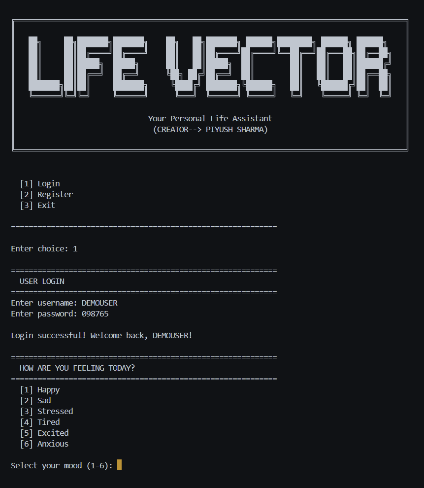
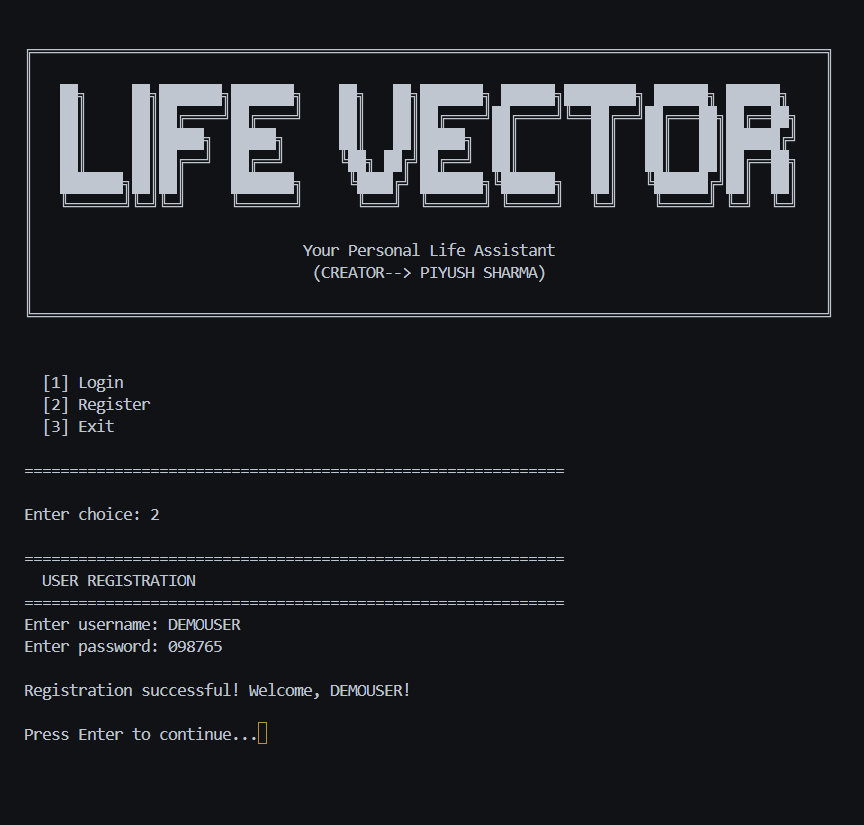
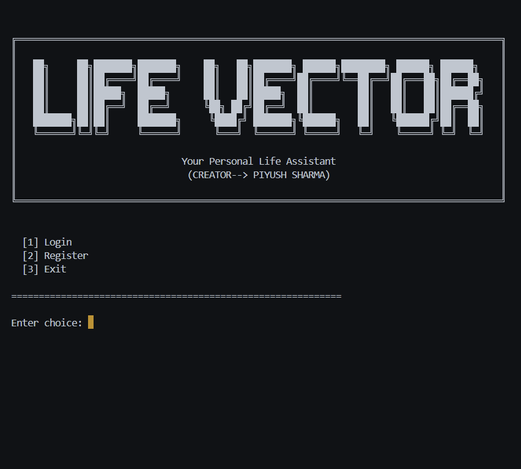
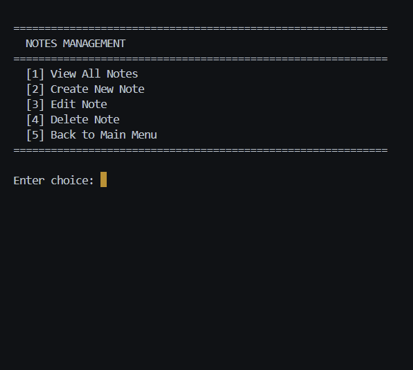
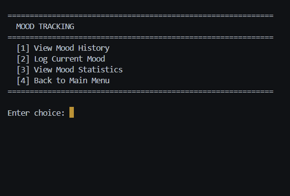
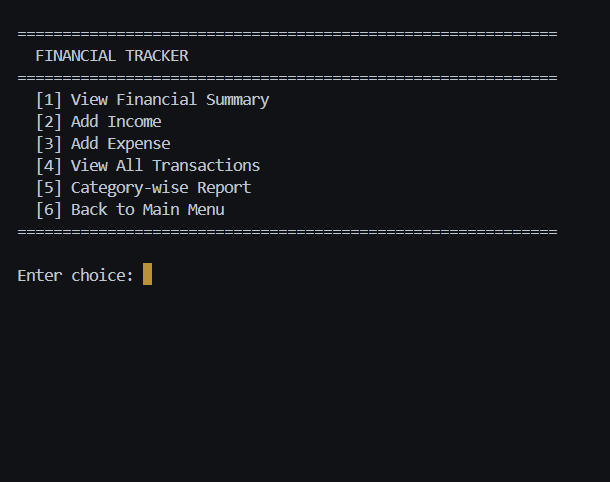

# 🌟 Life Vector – Personal Management System

Life Vector is a Python-based Command-Line Interface (CLI) application designed to help users manage their daily lives efficiently. It integrates productivity, financial tracking, and well-being tools into one system.

## 🚀 Features
- 🔐 User Authentication System
- 📋 Task and Goal Management
- 📝 Notes Manager
- 😊 Mood Tracker with Motivational Quotes
- 💰 Financial Tracker
- 📊 Interactive Dashboard
- 📁 File Handling using CSV and TXT

## 🛠️ Technologies Used
- Python
- CSV and Text File Handling
- OS, Datetime, Random, and Time Modules
- Command-Line Interface (CLI)

## 📂 Project Structure
life-vector/

│── main.py

│── quotes.txt

│── screenshots/

│── README.md

## 📸 Screenshots

### 🔐 Login Page


### 📝 Registration Page


### 🏠 Main Menu


### 📋 Task Management


### 📝 Notes Management


### 😊 Mood Tracker


### 💰 Financial Tracker


## ✅ How to use
- Keep the main.py and quotes.txt in same directory,
- Run main.py
### ▶️ How to Run
```bash
git clone https://github.com/piyushsharma-io/life-vector.git
cd life-vector
python main.py
```

## 🌱 Future Enhancements
- Graphical User Interface (Tkinter or PyQt)
- Data Visualization
- Web-Based Version using Flask or Django
- AI-powered productivity insights

## 👨‍💻 Author
Piyush Sharma
( Aspiring AI/ML Engineer )
